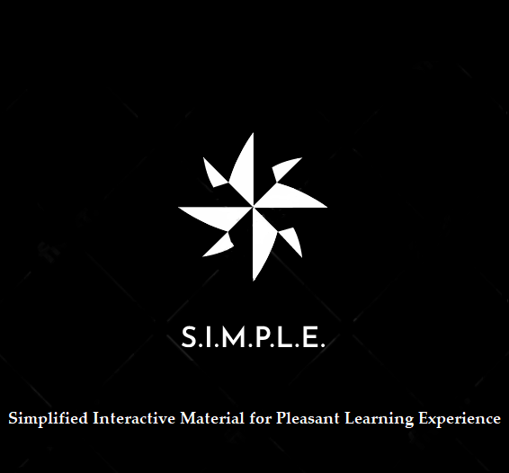

# SIMPLE

**S**implified **I**nteractive **M**aterial for **P**leasant **L**earning **E**xperience (whoa, quite the name :), or SIMPLE for short is database of resources that, as the name suggests plans to make the very best of resources readily available and thus, make learning fun.

### Why *SIMPLE*?
Picture this; you feel lost in a course, professor has recommended what seems like an infinite collection of material to read from and you just don't have the time, energy or motivation to go through all that. We, at *SIMPLE*, aim to filter out the best content and store it so that it's easily accessible to all.

We also envision *SIMPLE* to be a platform where you can get some exposure to courses and take informed decisions related to electives.

### What *SIMPLE* brings to you
- Course overview, syllabus covered, course structure explained clearly.
- Lecture slides, textbooks and problem sets relevant to the course.
- The best of content from across the World's universities.
- Related research papers and related content for further reading.
- Short video explanations for difficult concepts from IITB students; no substitute for peer learning ;)

### Why use *SIMPLE*?
You might be wondering there are plenty of YouTube videos available, why not watch on of them instead of going through the pain of accessing *SIMPLE* and searching for relevant material. But alas, *SIMPLE* gives you more than that.

- The compilation of the resources and their organization has been done in a systematic manner.
- The resources created are all stored at a single place (which place?) and only the relevant material has been added.
- Keeping in mind the time constraints, only that material which is insightful has been added and hence you won't find this database as a wastage of your time.

### Our Team
1. Abhishek Mahajan
2. [Advait Risbud](https://github.com/bolozubaankesari)
3. Ammar Barbhaiwala
4. [Aryan Gupta](https://github.com/chemistryanimation)
5. [Atharva](https://github.com/Atharva0709)
6. [Avichal Jain](https://github.com/AvichalJain)
7. [Chinmay Pimpalkhare](https://github.com/ChinmayPimpalkhare)
8. Dhawal Singh
9. [Jujhaar Singh](https://github.com/jujhaar2409)
10. [Kartik Gokhale](https://github.com/AWorldOfChaos)
11. [Pulkit Paliwal](https://github.com/PulkitPaliwal)
12. [Rehmat Singh Chawla](https://github.com/R-Bread)
13. Rounak Dalmia
14. Sarthak Jain
15. [Shashank Balaji](https://github.com/shashankbalaji02)
16. [Soham Joshi](https://github.com/jsoham)
17. [Tirthankar Mazumder](https://github.com/wermos)
